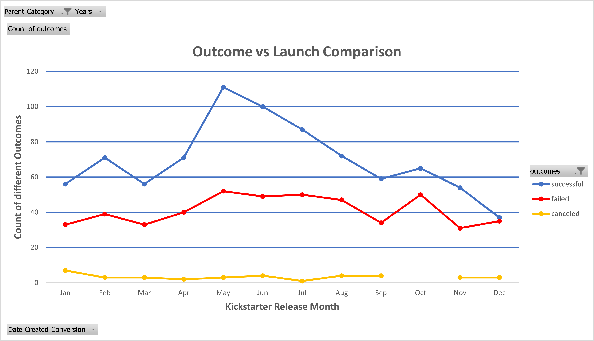

#  An Analysis of Kickstarter Campaigns

## Overview of Project
The organization, cleaning, and analysist of a vast crowd fundraising database to determine any factors crucial to a successful crowd fundraising campaign. Various data visualization tools will be utilized to exhibit the analysis in a more presentable and understanding way.

### Purpose
Performing analysis on Kickstart data to uncover trends to help better inform the up-and-coming playwriter, Louise. The information gathered from this analysis will help increase Louise's chances of a successful crowd fundraising campaign which will help fund her new play. 

## Analysis and Challenges
In this section, we will take a look at the analysis of the Kickstarter data, mention the challenges that may have been encountered, and how we were able to overcome these challenges. 

### Analysis of Outcomes Based on Launch Date
Here we organize and sort our data to look at the relation between the outcomes of crowd fundraising campaigns and the month of their launch date.

