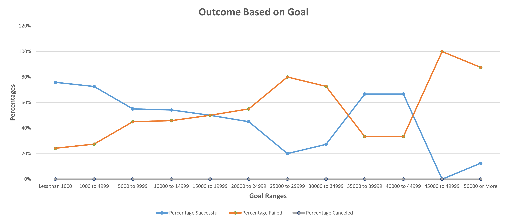

#  An Analysis of Kickstarter Campaigns

## <u> Overview of Project </u>
The organization, cleaning, and analysist of a vast crowd fundraising database to determine any factors crucial to a successful crowd fundraising campaign. Various data visualization tools will be utilized to exhibit the analysis in a more presentable and understanding way.

### <u> Purpose </u>
Performing analysis on Kickstart data to uncover trends to help better inform the up-and-coming playwriter, Louise. The information gathered from this analysis will help increase Louise's chances of a successful crowd fundraising campaign which will help fund her new play. 

## <u> Analysis and Challenges </u>
In this section, we will take a look at the analysis of the Kickstarter data, mention the challenges that may have been encountered, and how we were able to overcome these challenges. 

### <u> Analysis of Outcomes Based on Launch Date </u>
Here we organize and sort our data to look at the relation between the outcomes of crowd fundraising campaigns and the month of their launch date. We first filtered out all of the crowd fundraising campaigns that were not theatrically related. We then grouped all of the different theatrical campaigns into one of the three different outcomes (successful/failed/canceled), which were then sorted into the month that they were released. This process can be better visualized and understood through the image below.

 
 #### <u> Results #1 </u>
There are a few key things we can take away from this chart: 
* The biggest takeaway from the chart that beneficial to Louise is the number of successful campaigns made in the month of May. We can see a huge spike in increase of successful campaigns relative to the other months. This may be a good indication to determine when Louise should release her campaign. 
* On the contrary, we can see which month would be worst for Louise to have her launch date on. As we can see in the chart, December would be the worst launch month as it recorded the least successful campaigns. 
* Overall, it would be a good idea to have launch date around the middle of the year and avoid launch date towards the end.

### <u> Analysis of Outcomes Based on Goals </u>
Like we have done previously, we will organize and sort our data, but we now look at the relation between the outcomes of crowd fundraising campaigns and their monetary goal. We filtered the data to looking at only kickstarts with their subcategory labeled as plays. We then grouped the remaining data to the respective ranges their monetary goal fit in. We then sorted these ranges into their different outcomes. Using what we gathered, we were able to create an accurate percentage of how Kickstarter outcomes based on their monetary goal.

#### <u> Results #2 </u>
There are a few key things we can take away from this chart:
* One key point that can be determined from the chart is that the higher the monetary goal is, the higher the chances of the Kickstarter of failing. This can be clearly seen in the chart as any monetary goal between $45,000-$50,000 has been shown to have a 100% failure.
* One piece of information that can be beneficial to Louise is the best possible percentage of gaining the most amount of funding.
    - Setting a monetary goal that ranges from 35,000 to $44,999 is the best possible chance of gaining the most amount of funding.
    - However, setting a monetary goal that ranges less than $1,000 will provide the best possible chance of having a successful Kickstarter

### Challenges and Difficulties Encountered/ dataset limitations 
There are a few challenges and difficulties encountered when analyzing the data. These problems arise mostly from the limitations of the data. Although we were able to find and create certain trends between different elements of the dataset, we cannot determine whether they have a direct relationship together or if there is an external variable acting on this relationship. We also have not used the whole database to its fullest extent. For example, if we were able to extract and group the kick starters based on key information gathered from the "blurb" column, we can then plot a relationship between those key information and their outcomes. I believe this would be a great table that we can later create
